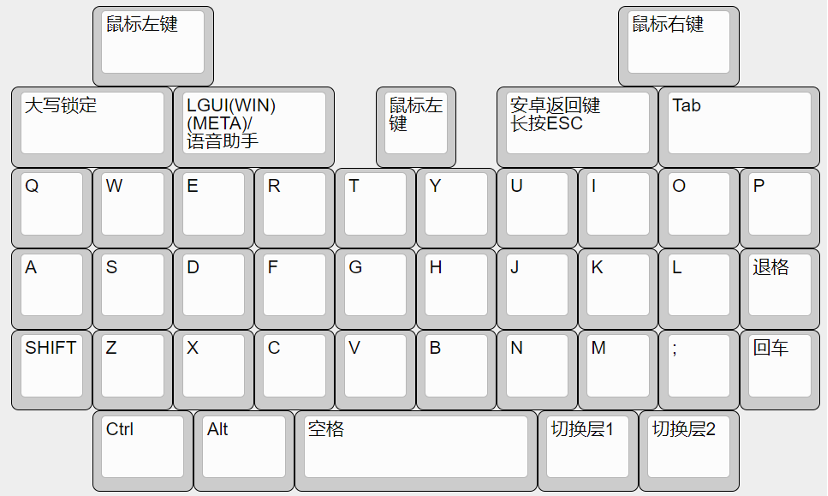

# 键盘各层按键说明

因为这个键盘键位比较少，需要引入多个层来打出平时需要的符号、字母以及功能按键，所以需要设置多层来打出这些键值。 同样的键盘按键在不同的层中有着相对应的键值。

在这个键盘中，轻按一下层切换按键就可以进入对应的层，然后再按一下这个层切换按键就可以退回到默认的字母层。

同时有四大金刚键的背光作为指示灯来指示对应的层数：
- 在默认字母层时，四大金刚键背光关闭；
- 在符号层(也就是层2)时，背光常量；
- 在层3时，背光闪烁。

1. 开机时默认为层 1，打出的字为 `QWERTY` 字母层
2. 轻按右下角sym键可以进入层 2，此时打出的字为印在每个键位上方的符号比如 `#` `1` `2` `3` `()`
3. 轻按最右下角的键可以进入层 3，层 3 含蓝牙设备连接选择功能键和一些符号键。

## 1 层

## 2 层

## 3 层

